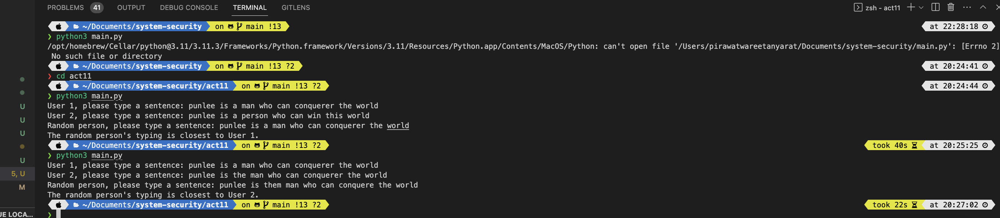

### Activity VII: Soft Biometric (Keystroke)

###### Pirawat Wareetanyarat 6238150221

---

#### 1

```
import re
from collections import defaultdict
from itertools import tee, islice
from typing import Dict, Tuple, Iterable

def pairwise(iterable: Iterable) -> Iterable:
    a, b = tee(iterable)
    next(b, None)
    return zip(a, b)

def nwise(iterable: Iterable, n: int = 3) -> Iterable:
    iterators = tee(iterable, n)
    for i, it in enumerate(iterators):
        next(islice(it, i, i), None)
    return zip(*iterators)

def calculate_frequencies(sentence: str) -> Tuple[Dict[str, int], Dict[str, int]]:
    digraphs = {"".join(digraph): 0 for digraph in pairwise(sentence)}
    trigraphs = {"".join(trigraph): 0 for trigraph in nwise(sentence, n=3)}
    for digraph in pairwise(sentence):
        digraphs["".join(digraph)] += 1
    for trigraph in nwise(sentence, n=3):
        trigraphs["".join(trigraph)] += 1
    return digraphs, trigraphs

def compare_frequencies(frequencies1: Dict[str, int], frequencies2: Dict[str, int]) -> int:
    total_difference = sum(abs(frequencies1.get(key, 0) - frequencies2.get(key, 0)) for key in set(frequencies1.keys()) | set(frequencies2.keys()))
    return total_difference

def authenticate_user(user1_sentence: str, user2_sentence: str, random_sentence: str) -> int:
    user1_digraphs, user1_trigraphs = calculate_frequencies(user1_sentence)
    user2_digraphs, user2_trigraphs = calculate_frequencies(user2_sentence)
    random_digraphs, random_trigraphs = calculate_frequencies(random_sentence)
    digraph_difference1 = compare_frequencies(user1_digraphs, random_digraphs)
    digraph_difference2 = compare_frequencies(user2_digraphs, random_digraphs)
    trigraph_difference1 = compare_frequencies(user1_trigraphs, random_trigraphs)
    trigraph_difference2 = compare_frequencies(user2_trigraphs, random_trigraphs)
    user1_score = digraph_difference1 + trigraph_difference1
    user2_score = digraph_difference2 + trigraph_difference2
    return 1 if user1_score < user2_score else 2

if __name__ == "__main__":
    user1_sentence = input("User 1, please type a sentence: ")
    user2_sentence = input("User 2, please type a sentence: ")
    random_sentence = input("Random person, please type a sentence: ")
    authenticated_user = authenticate_user(user1_sentence, user2_sentence, random_sentence)
    print(f"The random person's typing is closest to User {authenticated_user}.")

```



##### 1

How many words do we need to correctly identify the person?

###### Ans. The word count of this typing biometric identification system is dependent on the individual's typing habits, the digraphs in the text, and the precision of the timing measurements. More words and varied texts may more accurately depict a person's typing pattern, allowing for more precise identification. Our prediction is there has to be at least 10 words.

##### 2

Do you think this method is scalable? (to thousand persons) for either recognition system or identification system. Please provide your analysis.

##### Ans

The scalability of this process is determined by a number of parameters. Because each user's typing pattern can be saved in its own file and compared in real time, a recognition system that simply determines whether the typing pattern matches a known user can scale to thousands of users. A large number of users may cause an identification system to take too long to compare an unknown typing pattern to all known users' patterns. Effective algorithms and technology, on the other hand, may be able to solve this problem.

##### 3

Will you use this kind of authentication in your system? Please also provide a reason.

#### Ans

This authentication method depends on the use case and security requirements. Typing biometrics can be an effective authentication method for some applications, but not for all. It may be appropriate for low-risk applications, such as accessing personal devices or social media accounts, but not for high-risk applications, such as financial transactions or secure government systems. A biometric typing system requires hardware, software, and user training, which may be prohibitively expensive for some businesses.
