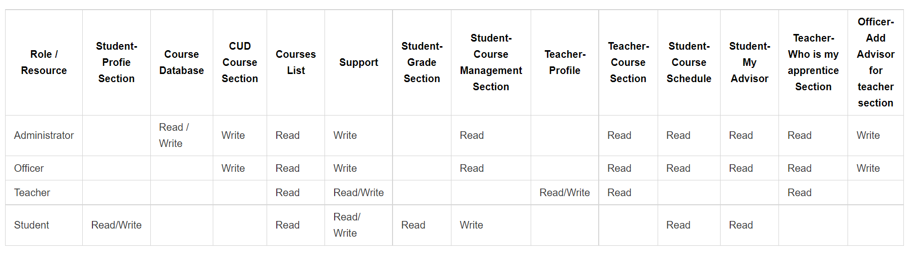

## Part 1

---

Assume that you are about to open a 24-hour coffee shop on the Chulalongkorn University campus called “Too Late To Sleep”. The coffee shop must provide services to all members of Chulalongkorn University (no entrance fee) and to outsiders (charge for entrance).

#### 1.1

---

###### Ans

For the ‘Too late To Sleep’, I will implement 2 methods in order to create a combination of authentication protocols, and both are ‘what do you know' and ‘what do you trust’. There are several different roles which are member ( Chulalongkorn University’s student and Chulalongkorn University’s officer ) ,non-member ( Outsider ),Barista (Staff), Manager (Admin), receptionist ( Staff )

| Name            |    Role    |
| --------------- | :--------: |
| Chula's student |   Member   |
| Chula's officer |   Member   |
| Barista         |   Staff    |
| Manager         |   Admin    |
| Receptionist    |   Staff    |
| Outsider        | Non-Member |

#### 1.2

---

###### Ans

My coffee shop will definitely have 1 entrance door, 1 bathroom, 1 coffee service area, and a place to sit. For users who have already registered as a member ( Chulalongkorn University student card ), They can enter by using a scan gate at the main entrance after entering the entrance door. The outsider or whoever wants to enter the coffee shop without a membership will need to go to the reception on the right side of the entrance to pay a fee. There are also sleeping boxes where we can sleep when we feel tired. There is also a manager's room too so that he/she can manage my coffee shop easily. Below is the list all resources that my coffee shop will have.

- entrace door
- bathroom
- coffee service area
- place to sit
- reception
- sleeping boxes
- Manager's room

#### 1.3

---

###### Ans

Below table is about the access and resources.
| Resource | Access Control |
| -------- | :-------------:|
| Bathroom | Everyone can use bahtroom |
| Reception | Only Receptionist and Manager |
| Sleeping Boxes | Only members |
| Manager's room | Only Manager |
| Coffee Service Area | Only Barista and Manager |
| Place to sit | Everyone can use |

#### 1.4

---

###### Ans

From my opinion, my coffee shop needs to be RBAC ( Role based access control ) so that we can apply roles for different users. Below is a Access Control Matrix
| | Bathroom | Reception | Sleeping Boxes | Manager's room | Coffee Service Are | Place to Sit |
| ------- | :-------: | :-------: | :-------: | :-------: | :-------: | :-------: |
| Barista | :white_check_mark: | | | | :white_check_mark:| :white_check_mark:|
| Chula's student | :white_check_mark: | | :white_check_mark:| | | :white_check_mark:|
| Chula's officer | :white_check_mark: | | :white_check_mark:| | | :white_check_mark:|
| Outsider (Non-member) | :white_check_mark: | | | | | :white_check_mark: (Need to pay fee)|
| Manager | :white_check_mark: | :white_check_mark:| | :white_check_mark:| :white_check_mark:| :white_check_mark:|
| Receptionist | :white_check_mark: | :white_check_mark: | | | | :white_check_mark:|

## Part 2

---

Assuming that you are now in charge of a new Registration Systems of Chulalongkorn University, please finish the following exercise.

#### 2.1

---

The registration systems of chulalongkorn university need to have several roles
| Name | Role |
| --------------- | :--------: |
| Administrator | Admin |
| Officer | Staff |
|Teacher| Teacher |
|Student | Member |
| Advisor | Advisor |

#### 2.2

---

For resources that you can find in the registration system, you can find in the below table.

- Student - Profile Section
- Course Database
- CUD Course Section
- Courses List
- Support
- Student - Grade Section
- Student - Course Management Section
- Teacher - Profile
- Teacher -Course Section
- Student - Course Schedule
- Student - My Advisor
- Teacher - Who is my apprentice section
- Officer - Add advisor for teacher section

#### 2.3

---

| Function                                |                 Resource                  |
| --------------------------------------- | :---------------------------------------: |
| Edit Student's profile                  |         Student - Profile Section         |
| Search and view list of courses         |                  Courses                  |
| Create, Update, or Delete Course detail |                CUD section                |
| View your grade                         |          Student - Grade Section          |
| Ask for help                            |                  Support                  |
| Edit Course curriculum                  |    Student - Course Management Section    |
| Edit teacher profile                    |         Teacher - Profile Section         |
| View your course                        |         Teacher - Course Section          |
| View your course schedule               |         Student - Course Schedule         |
| View my apprentice                      |   Teacher- Who is my apprentice section   |
| View my advisor                         |           Student - My advisor            |
| Assign advisor for student              | Officer - Add advisor for teacher section |

#### 2.4

---

Below is a Access Control Matrix that derive from all of resources and roles in my registration system:

