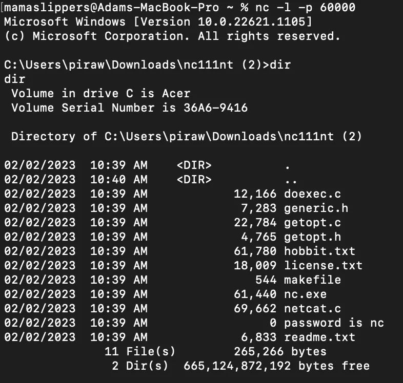

#### Exercise

1. Javascript Injection.

---

From the testing in class, I come up with this idea.

```const loginForm = document.getElementById("loginForm");
loginForm.addEventListener("submit", function(e) {
    e.preventDefault();
    const username = document.getElementById("username");
    const password = document.getElementsByName("password")[0];
    alert("username:"+username?.value+"\npassword:"+password?.value);
});
```

2. ncat

---

After using code in documentation, I come with this result


3. essay

---

a) The information that I have gained in this session has prepared me for the worst-case scenario that could result from the activity, which is that someone could steal my login and password from a website into which I log in. Anyone with even a little understanding of coding can use javascript injection to get whatever they want by utilizing javascript to acquire whatever they want. In this laboratory, I have created a "submit" event so that I can communicate the action that is being processed to either my server or my website. When a user fills a form on the website, this event is triggered. This event can be exploited to get access to sensitive information, such as a login and password. This danger is quite real, but it is avoidable by taking precautions like establishing a secure connection or utilizing two-factor authentication, for example. In addition, users should ensure that they constantly create robust passwords and never share their credentials with anybody else. Users have the ability to protect the confidentiality of their information by taking the appropriate safety measures.
My website could benefit from a secure connection, such as SSL or TLS encryption, which would provide an additional layer of defense against any harmful actions that might be taken against it. This will ensure that any data that is transported to and from the website is encrypted and safeguarded from any potential attackers that may be lurking in the shadows. In addition, I have the option of utilizing two-factor authentication in order to make it significantly more difficult for an unauthorized user to access my account. Last but not least, I also have the option to set up a web application firewall, which can screen out and prevent access to any potentially harmful requests before they even reach my website. By taking these additional precautions, I can ensure that both my website and the information it contains are kept safe and secure.

b) If I want to utilize netcat to develop a trojan horse, I will create a harmful link or something similar that tricks users into downloading or clicking on something they shouldn't. This will allow me to steal their personal information. This might be anything from a website or email link that appears to be legitimate but actually leads to a malicious website that has malicious code on its own website. The command that grants authorization to run the malicious code in the command prompt will be executed by the code whenever the user clicks the link that the code presents to them. The end result of this is that the device used by the user is now infected with the trojan horse, which means it can be used to inflict significant damage to other systems. As a result of this, it is of the utmost importance, from the point of view of the user, to exercise extreme vigilance and make certain that any links that are clicked upon are appropriately permitted and secured. If you want to keep yourself safe, you should never click on any links that you are doubtful about or have any doubts about, since doing so could lead to major problems such as the loss of data, corruption of data, or even the theft of your identity. I would strongly urge this.
Once the malicious code has been executed, it can be used to get access to the user's device and data, leaving the user open to a broad variety of criminal behaviors. This leaves the user exposed to being victimized by hostile actors. Users can help protect themselves from the potential risks that are associated with malicious links by making sure that all links are secure and authorized before clicking on them. This is an extremely critical step to take before clicking on any link. In addition, users should be aware of any links that appear to be suspicious at all times because clicking on such sites can quickly result in serious damage, including the theft of personal information or even data breaches.
