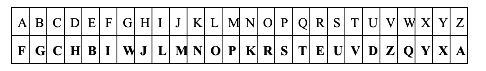
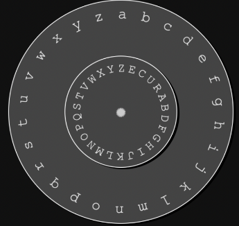
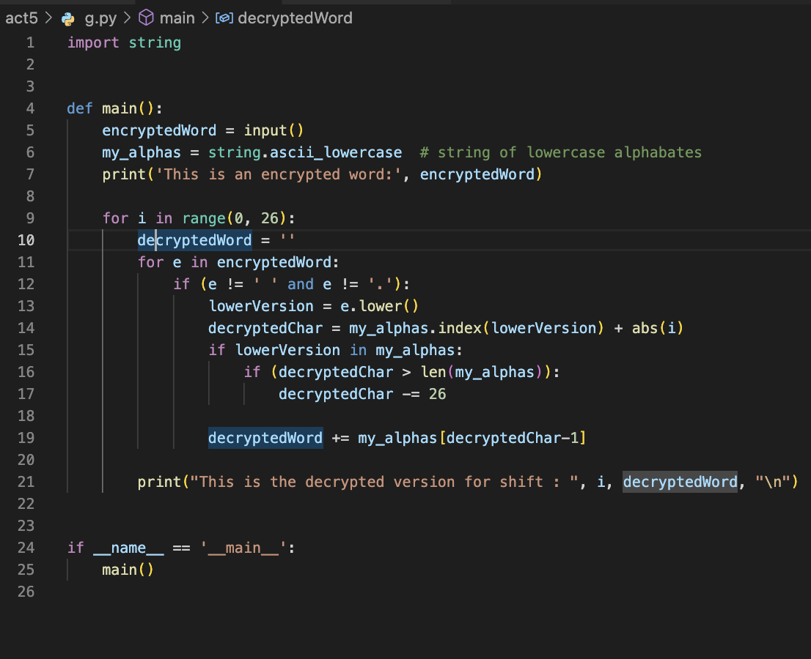
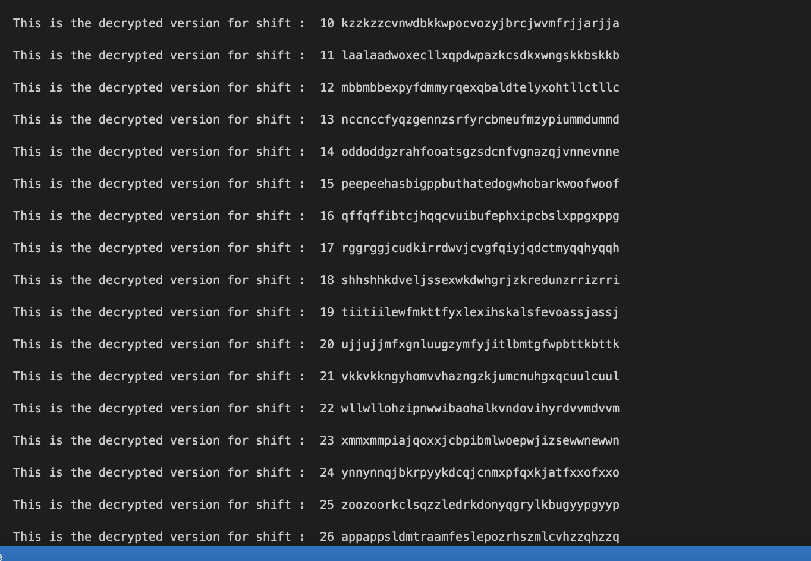
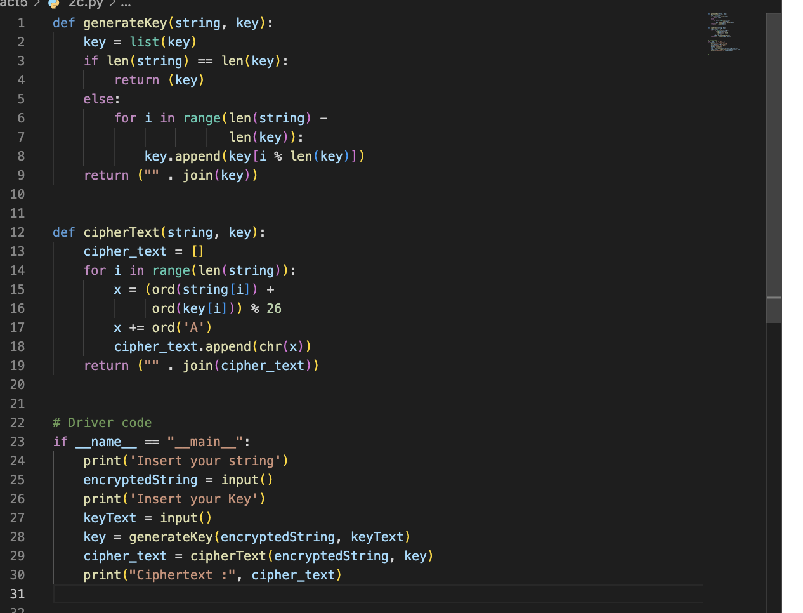
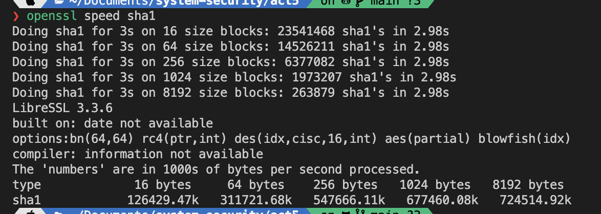
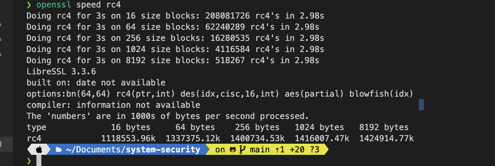
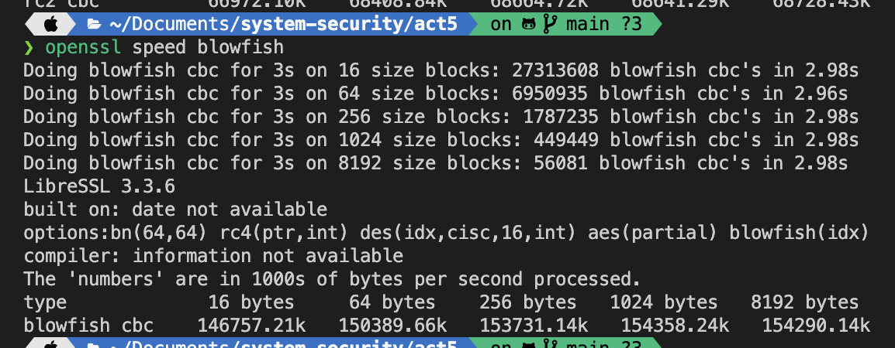
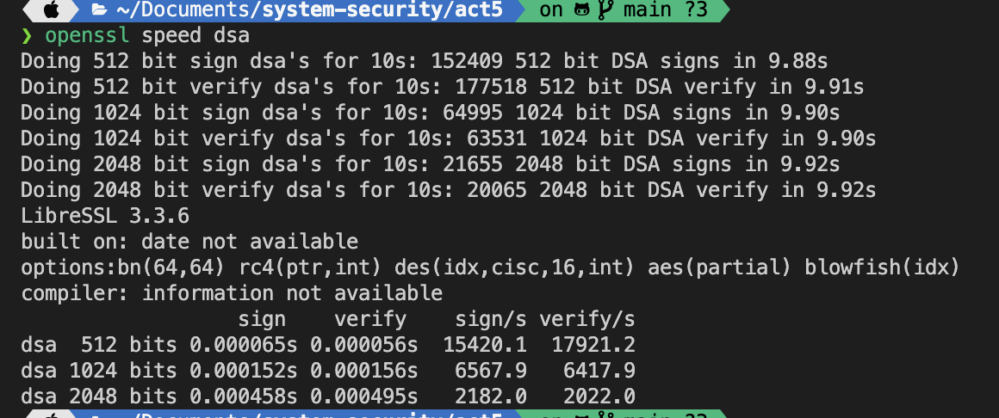

### Pirawat Wareetanyarat 6238150221

---

#### 1. (Encryption and Statistical Analysis) Though encryption is primarily designed to preserve confidentiality and integrity of data, the mechanism itself is vulnerable to brute force (statistical analysis). In other words, the more we see the encrypted data, the easier we can hack it. In this exercise, you are asked to crack the following cipher text. Please provide the decrypted result and explain your strategy in decrypting this text.

<u>Cypher text</u>
PRCSOFQX FP QDR AFOPQ CZSPR LA JFPALOQSKR. QDFP FP ZK LIU BROJZK MOLTROE.

##### a. Count the frequency and list the top 3

Here is the dictionary counting the frequency number in above string.
{'P': 7, 'R': 6, 'C': 2, 'S': 3, 'O': 6, 'F': 6, 'Q': 5, 'X': 1, 'D': 2, 'A': 3, 'Z': 3, 'L': 4, 'J': 2, 'K': 3, 'I': 1, 'U': 1, 'B': 1, 'M': 1, 'T': 1, 'E': 1}
The top 3 are P,R,O or F as well

##### b. Knowing that this is English, what are commonly used three-letter words and two-letter words. Does the knowledge give you a hint on cracking the given text?

verb to be is commonly used in english like is, am, are
Yes, it gives me a hint that FP should be is and QDR should be the

##### c. Cracking the given text. Measure the time that you have taken to crack this message.

arond 5 mins

##### d. Explain your process in hacking such messages.

1. I count and guess what are those 2,3 word using commonly in english
2. try using caesar cipher encryption
3. try guessing about the substitution
4. see the hint in the next question
5. make a disc so that i can put what i have already got on it.

##### e. If you know that the encryption scheme is based on Caesar(MonoalphabeticSubstitution) that is commonly used by Caesar for sending messages to Cicero, does it allow you to crack it faster?

YES

##### f.Draw a cipher disc of the given text.

##### g.

#### 2. (Symmetric Encryption) Vigenère is a complex version of the Caesar cipher. It is a polyalphabetic substitution.

##### a. Explain it

A method for encrypting alphabetic text, Vigenere Cipher. It employs a straightforward type of polyalphabetic substitution. A polyalphabetic cipher is any substitution-based cipher that employs numerous substitution alphabets. The original text is encrypted using the Vigenère square or the Vigenère table.

The table contains the alphabets printed 26 times in various rows, with each alphabet shifted cyclically to the left relative to the preceding alphabet, corresponding to the 26 possible Caesar Ciphers.
At certain stages of the encrypting procedure, the cipher utilizes a different alphabet from one of the rows.
The alphabet employed at each place is determined by a recurrent keyword.

##### b. If a key is the word “CAT”, please analyze the level of security provided by Vigenère compared to that of the Caesar cipher.

Base on what I have learned in class, yes, it gives higher security compared to Caesar cipher in several reasons. First, it contains key which means it will take a lot of if you don't know it. Second, The key will be changed to match with the length of target word.

##### c.Create a python program for ciphering data using Vigenère

#### 3. (Mode in Block Cipher) Block Cipher is designed to have more randomness in a block. However, an individual block still utilizes the same key. Thus, it is recommended to use a cipher mode with an initial vector, chaining or feedback between blocks. This exercise will show you the weakness of Electronic Code Book

Here is the answer between 2 different methods which are aes-256-cbc and aes-256-ecb

#### 4. (Encryption Protocol - Digital Signature)

##### a. Measure the performance of a hash function (sha1), RC4, Blowfish and DSA. Outline your experimental design. (Please use OpenSSL for your measurement)

Below images are the performance using openSSL CLI for testing.

##### b. Comparing performance and security provided by each method.

SHA1:

Due to weaknesses that have been revealed in the algorithm over the years, SHA1 is deemed insecure for many cryptographic applications. It is no longer advised for usage in modern systems.
SHA1 is a fast hash function that can be quickly computed on current CPUs.
RC4:

Due to the discovery of weaknesses inside the algorithm, RC4 is no longer deemed secure. It is not recommended for usage in new systems.
Performance: RC4 is a fast stream cipher, and can be computed quickly on current CPUs.
Blowfish:

Blowfish is a relatively secure block cipher that is still utilized by some legacy systems. It is no longer recommended for use in new systems, as it has been replaced by more secure algorithms such as AES.
Blowfish is a rapid block cipher that can be quickly computed on current machines.
DSA:

DSA is a widely-used public-key cryptosystem that is regarded as secure for digital signatures when proper key sizes are employed. Nonetheless, it is susceptible to particular types of attacks and should be employed with caution.
DSA's performance is inferior to that of other public-key cryptosystems, such as RSA. Still, it is fast enough for the majority of applications and is frequently used for digital signatures.
Ultimately, the choice of which method to employ is determined by the system's specific requirements, such as the required level of security and performance requirements. In general, algorithms like SHA256 and AES that are newer and more extensively used are preferred for the majority of applications, as they provide a good combination of security and performance. It is also essential to remember that the security of any cryptographic system is dependent not only on the algorithm employed, but also on key management, secure implementation, and the secure handling of sensitive data.

##### c. Explain the mechanism underlying Digital Signature. How does it combine the strength and weakness of each encryption scheme?

A digital signature verifies the authenticity and integrity of a digital message or document. Often, it is used to verify that a message or document has not been altered or forged, and that it was sent by the supposed sender.

Using a public-key cryptosystem, such as RSA or DSA, to generate a pair of keys—a private key and its matching public key—is the fundamental technique behind digital signatures. The owner keeps the private key confidential, while the public key is shared with others. The owner of the private key performs a mathematical operation on the message using the private key to generate a digital signature for a message or document. This procedure yields the digital signature, a string of bits that is unique to the message and the private key used to sign it.

Anybody can verify the digital signature using the public key corresponding to the private key used to generate the signature. The same mathematical procedure is performed on the message using the public key, and the result is compared against the digital signature. If the two values match, the signature is validated and the message is attributed to the alleged sender.

The reliability of the underlying public-key cryptosystem gives digital signatures their power. Due to the fact that the private key is kept secret, it is extremely difficult for an attacker to generate a valid digital signature for a message without knowing the private key. This enables highly confident authentication of the authenticity and integrity of a message or document.

The shortcoming with digital signatures, however, is that they can not guarantee confidentiality. Even if they do not have the private key used to create the signature, anyone who intercepts a digitally signed message can access its contents. Before the message is signed, it must be encrypted using a symmetric-key cryptosystem, such as AES or Blowfish, to ensure confidentiality.

Digital signatures combine the power of public-key cryptosystems in certifying the validity and integrity of a message or document with the flaw of lacking confidentiality. In conjunction with digital signatures, a symmetric-key cryptosystem is required for confidentiality.
