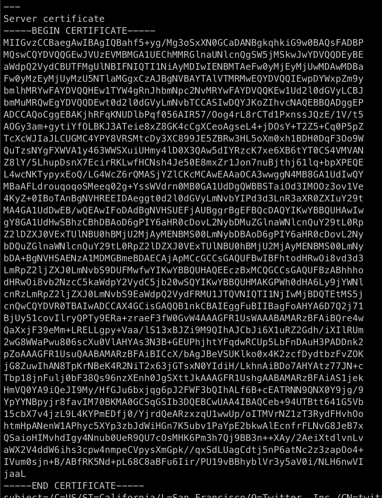
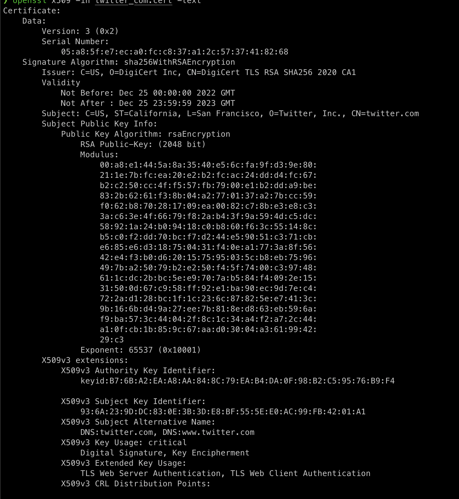
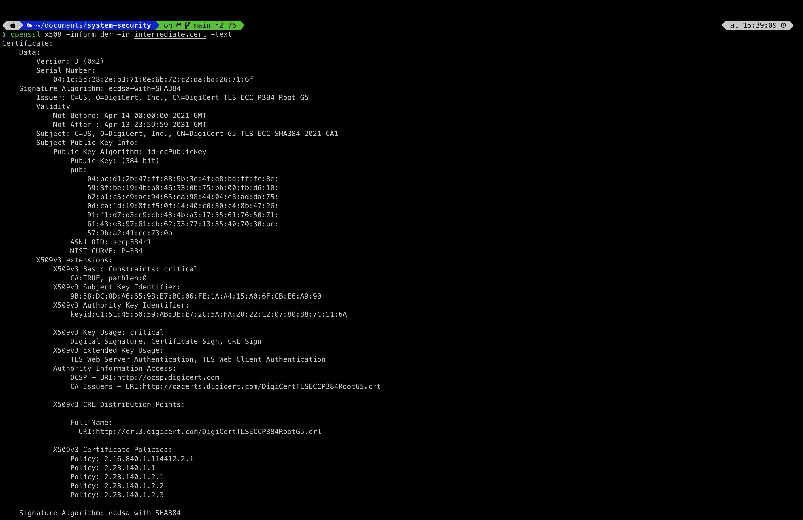
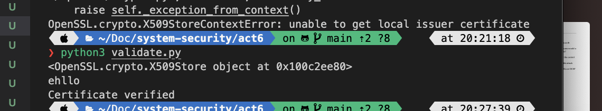

#### Active Public Key Infrastructure Pirawat Wareetanyarat 6238150221

##### 1. From the 2 given commands, What is the difference ?

###### Ans. The primary difference between the two commands is the manner in which OpenSSL calculates the set of trusted root CA certificates that can be used to verify the server's certificate during an SSL/TLS handshake.



##### 2. What does the error (verify error) in the first command mean? Please explain.

###### Ans. The client will raise a verify error if the server's supplied certificate cannot be confirmed for some reason. This issue may happen for a number of reasons, including a certificate that is out-of-date or revoked, a domain name that is inaccurate or mismatched, or a problem with the chain of trust between the server's certificate and the root CA.

##### 3. Copy the server certificate (beginning with -----BEGIN CERTIFICATE----- and ending with -----END CERTIFICATE-----) and store it as twitter_com.cert. Use the command openssl x509 -in twitter_com.cert -text to show a text representation of the certificate content. Briefly explain what is stored in an X.509 certificate (i.e. data in each field).

###### Ans.This is a TLS (Transport Layer Security) server certificate granted by DigiCert Inc in 2022 for the domain twitter.com. The validity period for this certificate is from Dec 25 00:00:00 2022 GMT to Dec 25 23:59:59 2023 GMT. The public key in the certificate is a 2048-bit RSA key that is used for server-client key exchange and authentication. The certificate has been signed using the SHA256withRSA technique. The certificate has a number of extensions that provide additional information and capabilities. The X509v3 extensions consist of the subject alternative name, key usage, extended key usage, certificate policies, fundamental constraints, and access to authority information.



##### 4. From the information in exercise 3, is there an intermediate certificate? If yes, what purpose does it serve? Hint: Look for an issuer and download the intermediate certificate. You may use the command openssl x509 -inform der -in intermediate.cert -text to show the details of the intermediate certificate. (Note that the -inform der is for reading the DER file. The default file format for x509 is the PEM file.)

###### Ans. Yes, there is an intermediate certificate, and the reason is that The trustworthy CA issues the intermediate certificate, which is used to sign the website's public TLS certificate. So, when a browser verifies a public TLS certificate, it also verifies the issuer of the intermediate certificate to ensure that it was issued by a trusted Certification Authority (CA). This establishes a trust chain from the trusted CA, through the intermediate certificate, to the website's public TLS certificate. The browser would display a security warning to the user if it were unable to verify that the public TLS certificate was issued by a trusted CA in the absence of the intermediate certificate.



##### 5. Is there an intermediate CA, i.e. is there more than one organization involved in the certification? Say why you think so.

###### Ans. Yes there is an intermediate CA, and there should be at least one for sure because of the certificate chain which are Twitter inc in server certificate and Digicert

##### 6.What is the role of ca-certificates.crt?

###### Ans. certificates issued by the Certification Authority. crt file plays a crucial role in establishing secure connections over TLS/SSL protocols by providing the client with a list of trusted root CAs against which to validate SSL certificates.

##### 7.Explore the ca-certificates.crt. How many certificates are in there? Give the command/method you have used to count.

###### Ans. There are 127 certificates in it. I use open file and then count every time the line starts with -----BEGIN CERTIFICATE-----\n

```
    def main():
        with open('../ca-certificates.cert', 'r') as cert_file:
            # Read the contents of the file
            cert_content = cert_file.readlines()
            cert_num = 0
            for e in cert_content:
            if (e == '-----BEGIN CERTIFICATE-----\n'):
                cert_num += 1
            print(cert_num)

```

##### 8. Extract a root certificate from ca-certificates.crt. Use the openssl command to explore the details. Do you see any Issuer information? Please compare it to the details of twitter’s certificate and the details of the intermediate certificate.

###### Ans. Yes, i saw ACCV as an issuer compared to the twitter (Digicert) and intermediate (Digicert)

```
    Certificate:
    Data:
        Version: 3 (0x2)
        Serial Number: 6828503384748696800 (0x5ec3b7a6437fa4e0)
    Signature Algorithm: sha1WithRSAEncryption
        Issuer: CN=ACCVRAIZ1, OU=PKIACCV, O=ACCV, C=ES
        Validity
            Not Before: May  5 09:37:37 2011 GMT
            Not After : Dec 31 09:37:37 2030 GMT
        Subject: CN=ACCVRAIZ1, OU=PKIACCV, O=ACCV, C=ES
        Subject Public Key Info:
            Public Key Algorithm: rsaEncryption
                RSA Public-Key: (4096 bit)
                Modulus:
                    00:9b:a9:ab:bf:61:4a:97:af:2f:97:66:9a:74:5f:
                    d0:d9:96:fd:cf:e2:e4:66:ef:1f:1f:47:33:c2:44:
                    a3:df:9a:de:1f:b5:54:dd:15:7c:69:35:11:6f:bb:
                    c8:0c:8e:6a:18:1e:d8:8f:d9:16:bc:10:48:36:5c:
                    f0:63:b3:90:5a:5c:24:37:d7:a3:d6:cb:09:71:b9:
                    f1:01:72:84:b0:7d:db:4d:80:cd:fc:d3:6f:c9:f8:
                    da:b6:0e:82:d2:45:85:a8:1b:68:a8:3d:e8:f4:44:
                    6c:bd:a1:c2:cb:03:be:8c:3e:13:00:84:df:4a:48:
                    c0:e3:22:0a:e8:e9:37:a7:18:4c:b1:09:0d:23:56:
                    7f:04:4d:d9:17:84:18:a5:c8:da:40:94:73:eb:ce:
                    0e:57:3c:03:81:3a:9d:0a:a1:57:43:69:ac:57:6d:
                    79:90:78:e5:b5:b4:3b:d8:bc:4c:8d:28:a1:a7:a3:
                    a7:ba:02:4e:25:d1:2a:ae:ed:ae:03:22:b8:6b:20:
                    0f:30:28:54:95:7f:e0:ee:ce:0a:66:9d:d1:40:2d:
                    6e:22:af:9d:1a:c1:05:19:d2:6f:c0:f2:9f:f8:7b:
                    b3:02:42:fb:50:a9:1d:2d:93:0f:23:ab:c6:c1:0f:
                    92:ff:d0:a2:15:f5:53:09:71:1c:ff:45:13:84:e6:
                    26:5e:f8:e0:88:1c:0a:fc:16:b6:a8:73:06:b8:f0:
                    63:84:02:a0:c6:5a:ec:e7:74:df:70:ae:a3:83:25:
                    ea:d6:c7:97:87:93:a7:c6:8a:8a:33:97:60:37:10:
                    3e:97:3e:6e:29:15:d6:a1:0f:d1:88:2c:12:9f:6f:
                    aa:a4:c6:42:eb:41:a2:e3:95:43:d3:01:85:6d:8e:
                    bb:3b:f3:23:36:c7:fe:3b:e0:a1:25:07:48:ab:c9:
                    89:74:ff:08:8f:80:bf:c0:96:65:f3:ee:ec:4b:68:
                    bd:9d:88:c3:31:b3:40:f1:e8:cf:f6:38:bb:9c:e4:
                    d1:7f:d4:e5:58:9b:7c:fa:d4:f3:0e:9b:75:91:e4:
                    ba:52:2e:19:7e:d1:f5:cd:5a:19:fc:ba:06:f6:fb:
                    52:a8:4b:99:04:dd:f8:f9:b4:8b:50:a3:4e:62:89:
                    f0:87:24:fa:83:42:c1:87:fa:d5:2d:29:2a:5a:71:
                    7a:64:6a:d7:27:60:63:0d:db:ce:49:f5:8d:1f:90:
                    89:32:17:f8:73:43:b8:d2:5a:93:86:61:d6:e1:75:
                    0a:ea:79:66:76:88:4f:71:eb:04:25:d6:0a:5a:7a:
                    93:e5:b9:4b:17:40:0f:b1:b6:b9:f5:de:4f:dc:e0:
                    b3:ac:3b:11:70:60:84:4a:43:6e:99:20:c0:29:71:
                    0a:c0:65
                Exponent: 65537 (0x10001)
        X509v3 extensions:
            Authority Information Access:
                CA Issuers - URI:http://www.accv.es/fileadmin/Archivos/certificados/raizaccv1.crt
                OCSP - URI:http://ocsp.accv.es

            X509v3 Subject Key Identifier:
                D2:87:B4:E3:DF:37:27:93:55:F6:56:EA:81:E5:36:CC:8C:1E:3F:BD
            X509v3 Basic Constraints: critical
                CA:TRUE
            X509v3 Authority Key Identifier:
                keyid:D2:87:B4:E3:DF:37:27:93:55:F6:56:EA:81:E5:36:CC:8C:1E:3F:BD

            X509v3 Certificate Policies:
                Policy: X509v3 Any Policy
                  User Notice:
                    Explicit Text:
                  CPS: http://www.accv.es/legislacion_c.htm

            X509v3 CRL Distribution Points:

                Full Name:
                  URI:http://www.accv.es/fileadmin/Archivos/certificados/raizaccv1_der.crl

            X509v3 Key Usage: critical
                Certificate Sign, CRL Sign
            X509v3 Subject Alternative Name:
                email:accv@accv.es
    Signature Algorithm: sha1WithRSAEncryption
         97:31:02:9f:e7:fd:43:67:48:44:14:e4:29:87:ed:4c:28:66:
         d0:8f:35:da:4d:61:b7:4a:97:4d:b5:db:90:e0:05:2e:0e:c6:
         79:d0:f2:97:69:0f:bd:04:47:d9:be:db:b5:29:da:9b:d9:ae:
         a9:99:d5:d3:3c:30:93:f5:8d:a1:a8:fc:06:8d:44:f4:ca:16:
         95:7c:33:dc:62:8b:a8:37:f8:27:d8:09:2d:1b:ef:c8:14:27:
         20:a9:64:44:ff:2e:d6:75:aa:6c:4d:60:40:19:49:43:54:63:
         da:e2:cc:ba:66:e5:4f:44:7a:5b:d9:6a:81:2b:40:d5:7f:f9:
         01:27:58:2c:c8:ed:48:91:7c:3f:a6:00:cf:c4:29:73:11:36:
         de:86:19:3e:9d:ee:19:8a:1b:d5:b0:ed:8e:3d:9c:2a:c0:0d:
         d8:3d:66:e3:3c:0d:bd:d5:94:5c:e2:e2:a7:35:1b:04:00:f6:
         3f:5a:8d:ea:43:bd:5f:89:1d:a9:c1:b0:cc:99:e2:4d:00:0a:
         da:c9:27:5b:e7:13:90:5c:e4:f5:33:a2:55:6d:dc:e0:09:4d:
         2f:b1:26:5b:27:75:00:09:c4:62:77:29:08:5f:9e:59:ac:b6:
         7e:ad:9f:54:30:22:03:c1:1e:71:64:fe:f9:38:0a:96:18:dd:
         02:14:ac:23:cb:06:1c:1e:a4:7d:8d:0d:de:27:41:e8:ad:da:
         15:b7:b0:23:dd:2b:a8:d3:da:25:87:ed:e8:55:44:4d:88:f4:
         36:7e:84:9a:78:ac:f7:0e:56:49:0e:d6:33:25:d6:84:50:42:
         6c:20:12:1d:2a:d5:be:bc:f2:70:81:a4:70:60:be:05:b5:9b:
         9e:04:44:be:61:23:ac:e9:a5:24:8c:11:80:94:5a:a2:a2:b9:
         49:d2:c1:dc:d1:a7:ed:31:11:2c:9e:19:a6:ee:e1:55:e1:c0:
         ea:cf:0d:84:e4:17:b7:a2:7c:a5:de:55:25:06:ee:cc:c0:87:
         5c:40:da:cc:95:3f:55:e0:35:c7:b8:84:be:b4:5d:cd:7a:83:
         01:72:ee:87:e6:5f:1d:ae:b5:85:c6:26:df:e6:c1:9a:e9:1e:
         02:47:9f:2a:a8:6d:a9:5b:cf:ec:45:77:7f:98:27:9a:32:5d:
         2a:e3:84:ee:c5:98:66:2f:96:20:1d:dd:d8:c3:27:d7:b0:f9:
         fe:d9:7d:cd:d0:9f:8f:0b:14:58:51:9f:2f:8b:c3:38:2d:de:
         e8:8f:d6:8d:87:a4:f5:56:43:16:99:2c:f4:a4:56:b4:34:b8:
         61:37:c9:c2:58:80:1b:a0:97:a1:fc:59:8d:e9:11:f6:d1:0f:
         4b:55:34:46:2a:8b:86:3b
```

##### 10. Twitter has a certificate verified.

###### Ans. Twitter



##### 11. Nowaday, there are root certificates for class 1 and class 3. What uses would a class 1 signed certificate have that a class 3 doesn't, and vice versa?

##### Ans. Class 1 and Class 3 certifications differ in the extent of identity verification and, consequently, the level of trust connected with the certificate. Class 3 certificates provide a higher level of trust than Class 1 certificates due to a more stringent identity verification process. Hence, websites that require a higher level of trust and security, such as those that handle sensitive data, should utilize an SSL/TLS certificate of Class 3. For low security, class 1 suffices.

##### 12.

###### Ans.

a

- Providing counterfeit SSL/TLS certificates for websites or services, allowing an attacker to capture and alter sensitive data such as passwords and financial information.
- By issuing fake certificates for legitimate websites or services, impersonators impersonate reputable websites or services. This could enable the attacker to conduct phishing attacks and deceive victims into giving sensitive information or downloading malware.
- Conducting a man-in-the-middle (MITM) attack, intercepting traffic between users and legitimate websites or services, and perhaps stealing or modifying sensitive data.
- The manipulation of software updates or security patches, which could allow an attacker to install malware or other harmful software on a victim's system.

The attacker might use the compromised Root CA to issue fake SSL/TLS certificates for high-profile websites or services, as one conceivable attack configuration. The attacker might then use these certificates to conduct man-in-the-middle (MITM) attacks, intercepting traffic between users and legitimate websites and potentially obtaining sensitive information. Additionally, the attacker might use the counterfeit certificates to conduct phishing attacks, deceiving users into giving their credentials or downloading malware.
b
CRLs (Certificate Revocation Lists) and OCSP (Online Certificate Status Protocol) may not be sufficient for protection in the scenario mentioned above. CRLs and OCSP are dependent on the prompt revocation of fraudulent certificates by the CA and the consequent update of revocation information in the CRL or OCSP responder. If the compromised Root CA is not discovered for months, fake certificates issued by the attacker may not be revoked in a timely way and may not be identified by CRL or OCSP checks.
