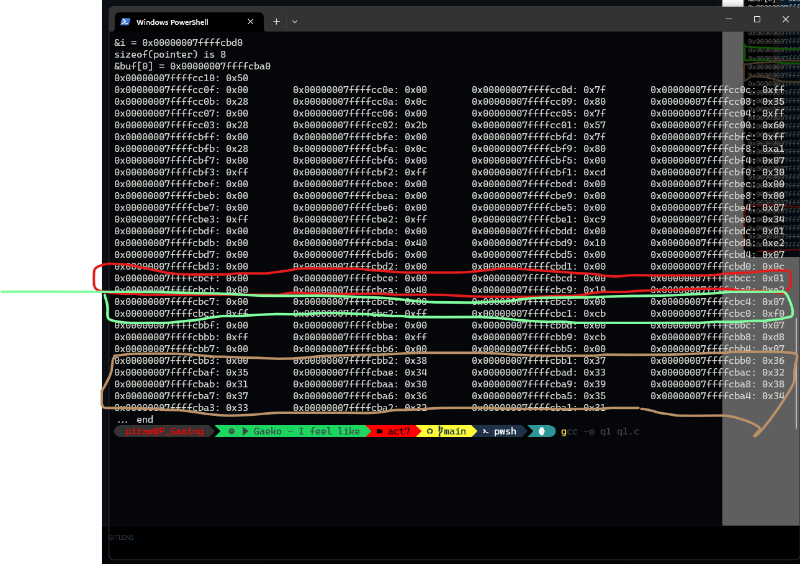
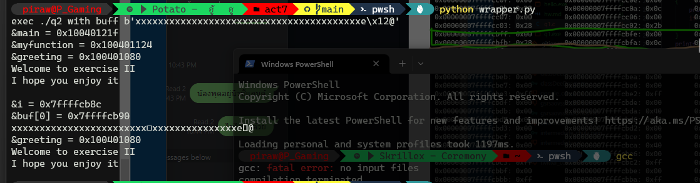
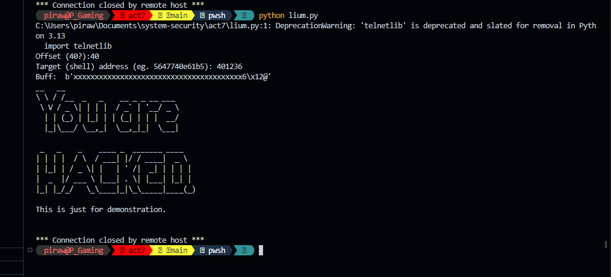

#### Activity 10 : Buffer Overflow

##### Exercise

##### 1. **Stack Layout:** Let's start with a simple program

##### 2.

##### 3.

##### 4.

###### Ans.

I would say Yes, you can explode the buffer-overflow. However, it needs a technique so that you can bypass the canary which acts as a sentinel. There are several techniques such as canary value leak, canary value prediction, canary value overwrite, and canaray value blind overwrite.

##### 5.1

###### Ans.

It is not easy to exploit buffer overflow attacks, but it is not impossible either. It demands a particular amount of competence and knowledge in programming and computer security.

To exploit a buffer overflow flaw, an attacker must comprehend the target program's structure and memory management. In addition, they must be able to generate malicious input that can cause a buffer overflow and execute their own code or insert malicious payloads into the system.

Developing a software to attack buffer overflow vulnerabilities in a server can be a difficult operation, requiring an in-depth knowledge of the target system, the programming language used to construct the server, and the operating system on which it operates. In addition, it may entail advanced techniques such as shellcode injection and return-oriented programming.

##### 5.2

###### Ans.

By adhering to secure coding principles, it is feasible to prevent buffer overflow vulnerabilities in your code. These are some effective strategies: Stack Safety Features: Employ compiler features such as stack canaries and address space layout randomization (ASLR) to add buffer overflow protection.
