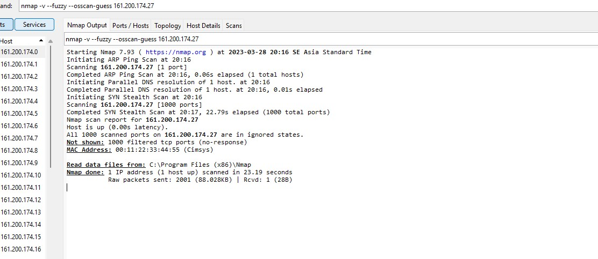
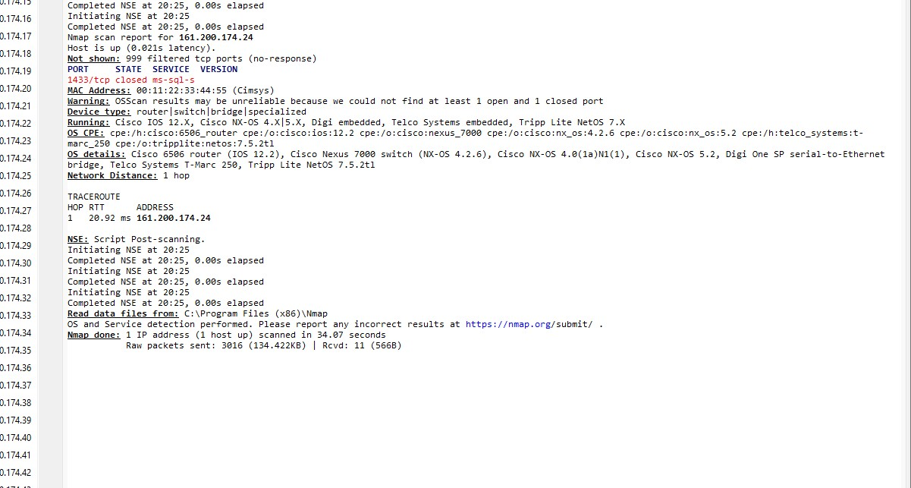

#### Activity 11: Network Scanner with NMAP

##### Student: Pirawat Wareetanyarat

---

##### 1. Please connect to your university network (e.g ChulaWIFI or eduroam). We will use a simple ping scan to identify online hosts. Don’t forget to substitute 10.201.3.0 with your network address. Please explain the parameters (-sn).

```bash
nmap -v -sn 10.201.3.0/2
```



###### Ans.

-sn means to perform ping scan .

##### 2. Pick an ip address from the list in exercise 1 (maybe get the ip address of your friend). We will try to detect the OS from the network footprint.

###### Ans. I choose 161.200.174.24. Below is what i get.



##### 3. Assuming that you are asked to identify all web servers on a campus, which command will you use to obtain the information. Please explain with an explicit example

###### Ans.

```bash
nmap -p 80,8080,443,8443 -sV -oA web-servers-scan 192.168.1.0/24

```

These are the options used in this command:

- p specifies the scan ports. We provide the HTTP and HTTPS ports 80, 8080, 443 and 8443 for web servers.
- sV enables version detection, which attempts to identify the software version running on the examined ports. This helps to uniquely identify web servers.

- oA specifies the name and format of the output file. Here, we utilize the web-servers-scan format to save the results in three distinct formats: standard, XML, and grepable.

This command scans all hosts within the specified IP address range for the specified ports and determines whether web server software is operating on those ports. The result will contain the IP addresses of the hosts with open web server ports, as well as the software versions and other details regarding the services running on those ports.
